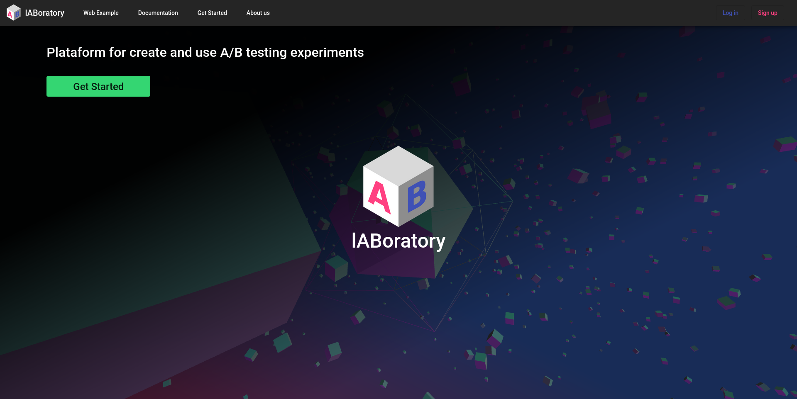
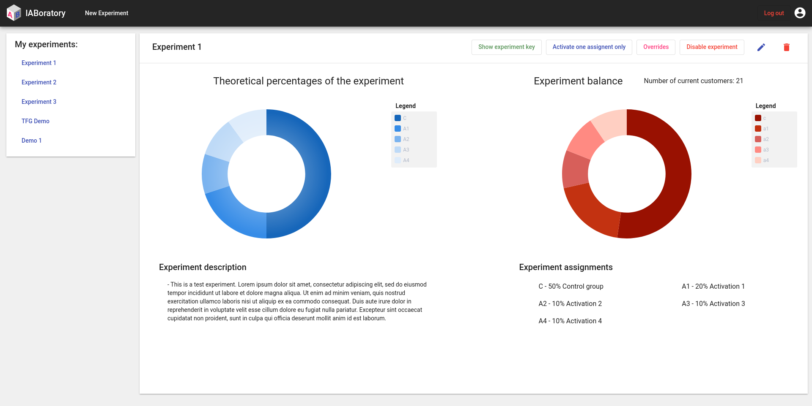

# lABoratory
Platform for create and use A/B testing experiments.

## Description of the project and objective to be achieved
A/B testing is a way of experimenting that is used in the context of digital marketing and web analytics to identify changes that maximize a specific result. For example, different customers of an online shopping page may see different products, ads in different places, or different prices for the same product, based on that experiment. By obtaining metrics linked to the experiment, it is possible to determine the optimality of each option and finally make a decision based on the results.

The users will be able to create and configure an experiment through a web page, with a specific name (unique key), as well as a set of activations, which will normally be: "C" (control group) and some activations like "A1" (active experiment 1), but which can be be more (A2, A3, etc.). Also, you can assign certain percentages to activations, being the total of 100% (for example, 50% to the control group, 25% to activation A1 and 25% to activation A2). It will also have the functionality to completely disable the experiment (100% assignment to C) or to completely launch any of the activations (100% to A1, A2 or the desired activation).

A web user using this experimentation service should always receive the same treatment. Therefore, a web service will be included. This service will expose an API that will allow obtaining the value (C, A1, A2, etc) of the experiment for a certain unique key. When the user consults a treatment for the first time, a random value will be assigned based on the assigned percentages. However, successive queries for the same key must return the same value to ensure the experiment consistency. When the assignments of activations is changed, is important to keep the previous assignments as far as possible for the key/treatment pairs already generated, while respecting the new percentages. Finally, it must be possible to create an exception (override) for a certain key, to assign a specific treatment.

## Techonologies to use
 - [ ] .Net
 - [x] Go
 - [ ] Java
 - [x] Angular
 - [ ] React
